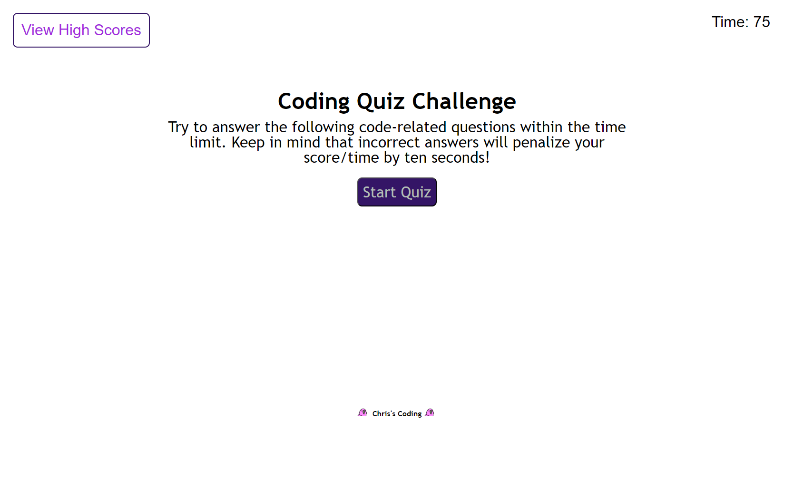

# Timed Javascript Quiz
## Description:

This is a timed quiz on JavaScript fundamentals that can store high scores in the local storage

There is a basic home/landing page that the user has an option to start the quiz or view the high scores

When the user starts the quiz the page is cleared and the timer is started

Questions will show up with option boxes. The user must click an option box to answer the question.
An answer for the last question will show up at the bottom of the quiz and dissapear after 7 seconds

Quiz is over once 5 questions have been asked or the time runs out.

At results page the user can see their score and save their score and their initials to local storage

The high score page has an ordered list of scores from high to low that shows the currently stored users and scores
At the high score page the user has an option to either go back to the main menu or clear the local storage

## Links:
This project can be viewed by going to [https://chrisosbii.github.io/041j2cAIbG2T/](https://chrisosbii.github.io/041j2cAIbG2T/)

## Screenshot:

## Bonuses:
* High Score lists will order itself by scores
* Added about 10 questions and right now it randomly picks 5 of them

## Regrests:
* Score is based purly on if you answered a question as fast as you can
* Would have liked to made the answer buttons have a scrambled order
* Better colors
* timer does not end right away sometimes I assume this is an issue with where the count is happening
* score currently does not go negative if you just run out of time and don't answer any questions